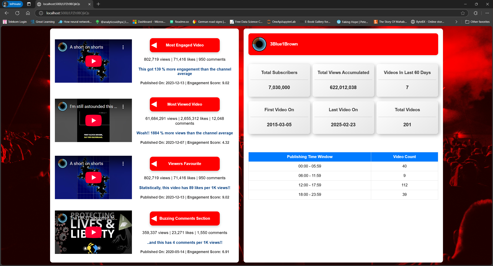

# YouTube Trivia Web App 

A web application built using Python & Flask. The python code leverage YouTube API to fetch stats from YouTube. 

User input: YouTube video url.

Output: Trivia and stats about the channel.

